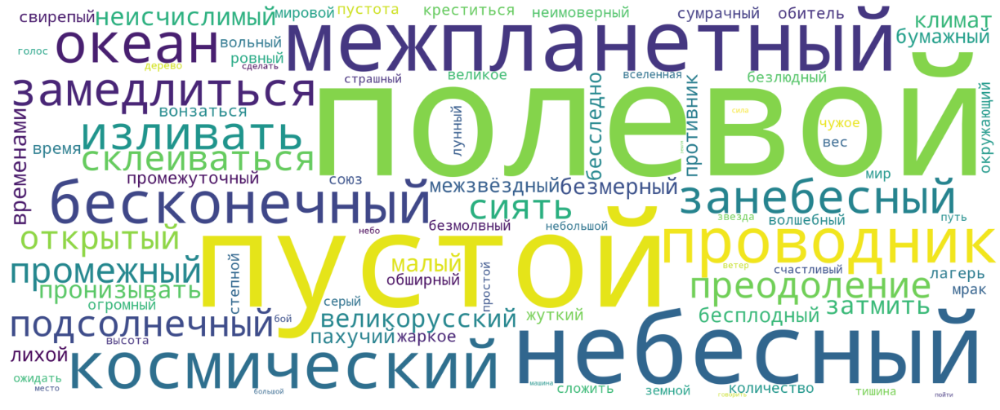

# NLP
**Поиск устойчивых выражений в рассказах Андрея Платонова с помощью статистических методов на Python, визуализация облака слов.**  
  
— Парсинг сайта и извлечение 128 текстов А. Платонова с помощью библиотеки BeautifulSoup  
— Токенизация и лемматизация текстов с NLTK, pymorphy2  
— Извлечение устойчивых словосочетаний (биграмм) с помощью метода библиотеки NLTK  
— Подсчет частей речи с помощью spaCy, визуализация диаграммы на matplotlib  
— Визуализация облака слов, где размер слова зависит от полученной статистики  
— Выводы по эмоциональному окрасу  слов из рассказов Платонова  

Презентация проекта: https://drive.google.com/file/d/12wDlIvBckJMfGrquRVxCFRxlZnMJtlbE/view?usp=sharing
  
